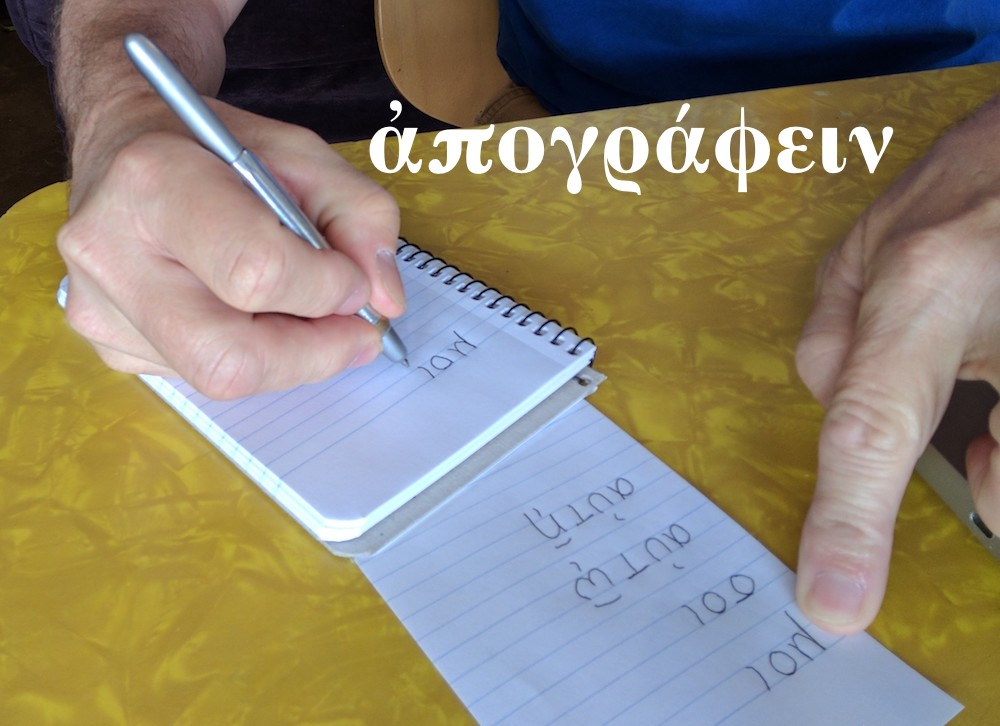
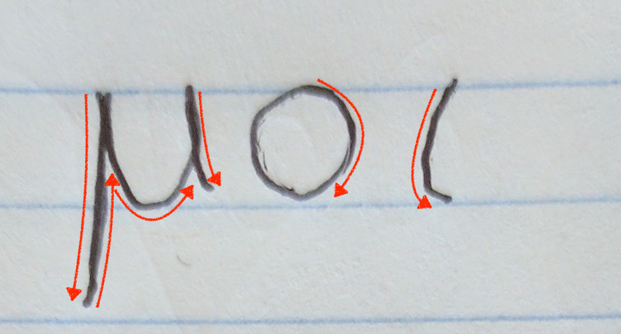
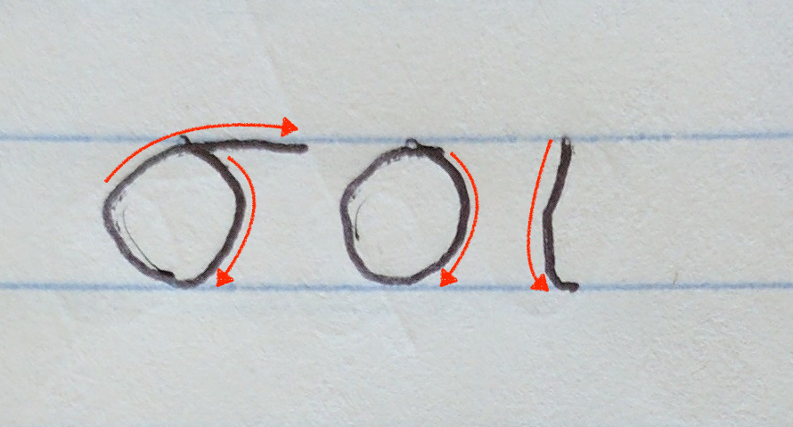
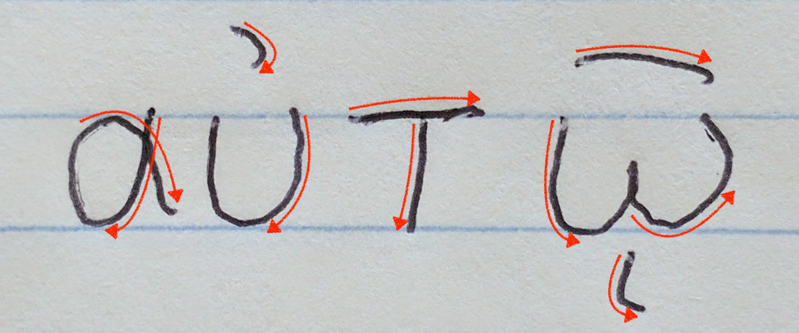
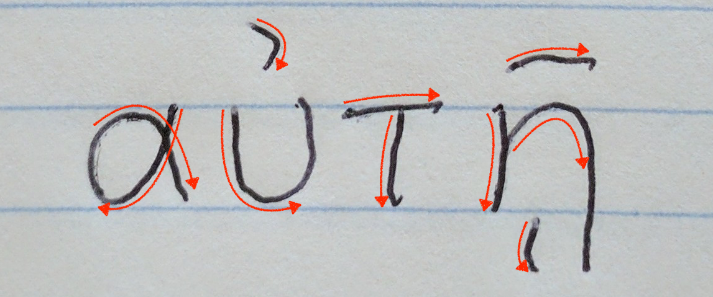
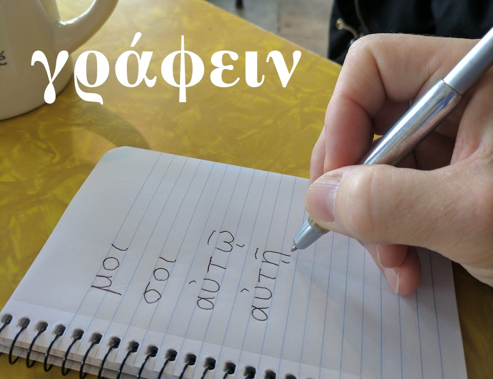

<h1>Student Practice for Lesson Four 
τὸ μελέτημα τοῦ μαθήματος τοῦ τετάρτου</h1>

<h3>ἀπογράφε τοὺς λόγους:</h3>

<table>
  <tr>
    <td>
      <ol style="font-size:200%">
        <li>μοι </li>
        <li>σοι </li>
      </ol>
    </td>
    <td>
      <ol style="font-size:200%">
        <li>αὐτῷ </li>
        <li>αὐτῇ </li>
      </ol>    
    </td>
  </tr>
</table>

<h3>γράφε <em>αὐτῷ, αὐτῇ, μοι,</em> ἤ <em>σοι</em> καὶ τὸ ὄνομα.</h3>

<ol style="font-size:150%">
  <li>τί ὄνομά σοι; 
  ὄνομα ,  ἐστιν.</li>
  <li>(Παῦλος) 
  τί ὄνομα αὐτῷ; 
  ὄνομά ,  ἐστιν.</li>
  <li>(Μιχαήλ) 
  τί ὄνομά μοι; 
  ὄνομά ,  ἐστιν.
  </li>
  <li>(Σάρρα) 
  τί ὄνομα αὐτῇ; 
  ὄνομά ,  ἐστιν.
  </li>
  <li>(Ἰωνάθαν) 
  τί ὄνομά μοι; 
  ὄνομά ,  ἐστιν.
  </li>
</ol>