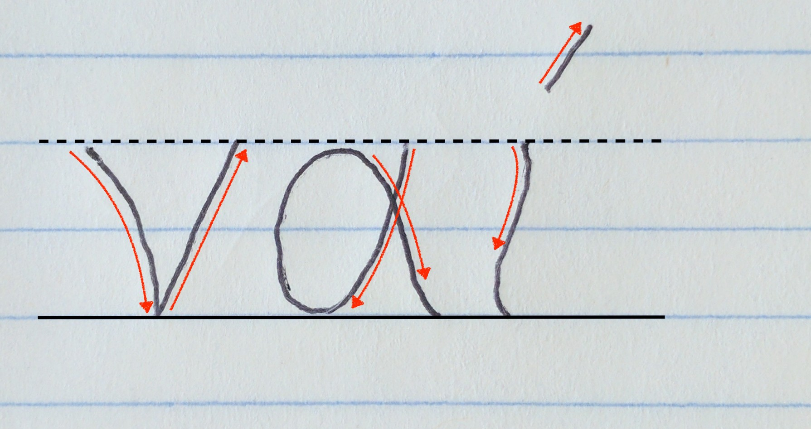
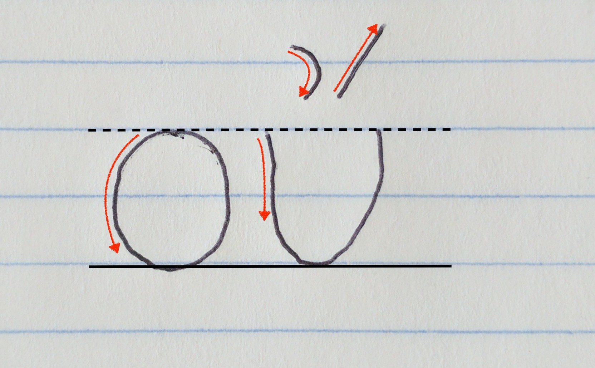
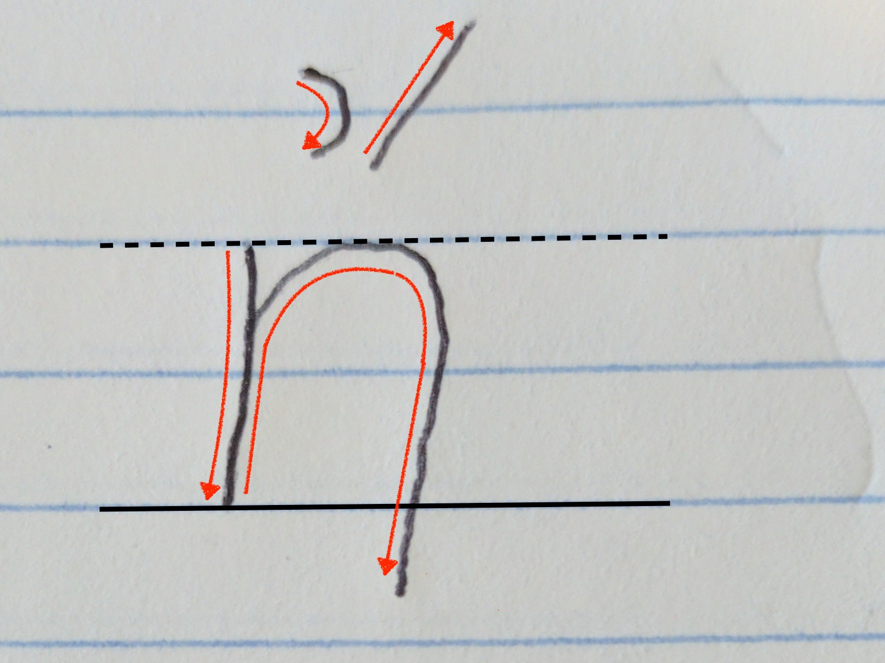
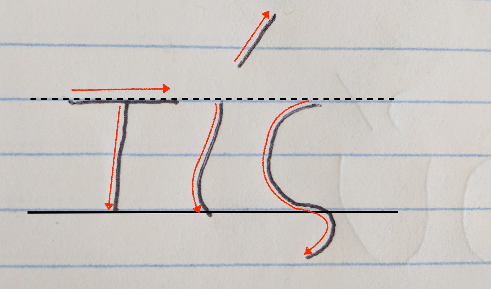

<h1>Writing Practice for Lesson One 
τὸ μελέτημα τοῦ μαθήματος τὸ πρῶτον</h1>

<h2>Copy the following words</h2>

<table>
  <tr>
    <td>
      <ul style="font-size: 200%">
        <li>ναί </li>
        <li>οὔ </li>
      </ul>
    </td>
    <td>
      <ul style="font-size: 200%">
        <li>ἤ </li>
        <li>τίς </li>
      </ul>
    </td>
  </tr>
</table>
<h2>Write <em>ναί</em> or <em>οὔ</em>, whichever is appropriate.</h2>
<ul>
  <li>
👍 
</li>
  <li>
👎 
</li>
  <li>
👩 Μαρία 
</li>
  <li>
👩 Ἰωάνης 
</li>
  <li>
👨 Μαρία 
</li>
  <li>
👨 Ἰωάνης 
</li>
</ul>

