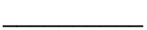

<h1>Student Practice Page for Lesson Two</h1>

<h2>Copy the following words:</h2>

<table>
  <tr>
    <td>
    <ol style="font-size:150%">
      <li>ἐγώ </li>
      <li>σύ </li>
      <li>αὐτός </li>
      <li>αὐτή </li>
    </ol>
    </td>
    <td>
    <ol style="font-size:150%">
      <li>με </li>
      <li>σε </li>
      <li>αὐτόν </li>
      <li>αὐτήν </li>
      <li>πρός </li>
    </ol>
    </td>
  </tr>
</table>
<h2>Write αὐτός or αὐτή in the blank, depending on which makes best sense:</h2>
<ol style="font-size:200%">
  <li>👨 τίς ἐι;  </li>
  <li>👩 τίς ἐι;  </li>
  <li> Παῦλος ἐι.</li>
  <li> Μάρθα ἐι.</li>
  <li> Ἰώαννης ἐι.</li>
  <li> Κυνθία ἐι.</li>
</ol>