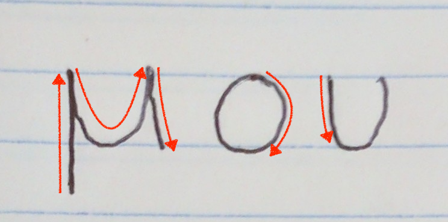
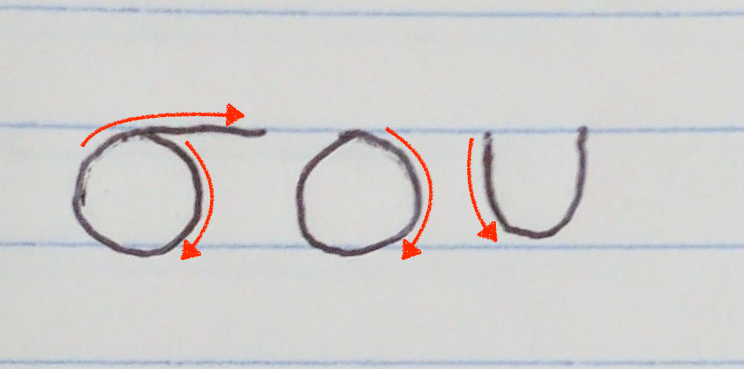
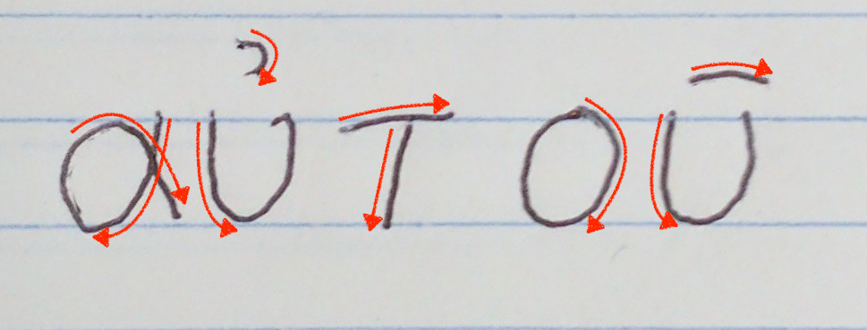
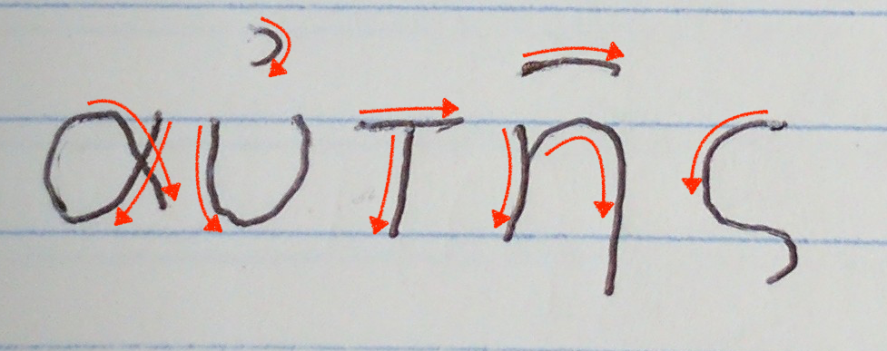

<h1>Student Practice for Lesson Three
τὸ μελέτημα τοῦ μαθήματος τὸ τρίτον</h1>

<h3>Copy the following words:</h3>

<table>
  <tr>
    <td>
    <ol style="font-size:150%">
      <li>ἐγώ </li>
      <li>σύ </li>
      <li>αὐτός </li>
      <li>αὐτῆ </li>
    </ol>
    </td>
    <td>
    <ol style="font-size:150%">
      <li>μου </li>
      <li>σου </li>
      <li>αὐτοῦ </li>
      <li>αὐτῆς </li>
    </ol>
    </td>
  </tr>
</table>
<h3>Write <em>μου, σου, αὐτοῦ,</em> or <em>αὐτῆς</em> in the blank, depending on which makes best sense:</h3>

The first sentence should include your own name.

<ol style="font-size:200%">
  <li>τὸ ὄνομά ,  ἐστιν.</li>
  <li>👩 τὸ ὄνομά , Κυνθία ἐστιν.</li>
  <li>👨 τὸ ὄνομά , Ἰώαννης ἐστιν.</li>
  <li>τὸ ὄνομά  Μάρθα ἐστιν.</li>
  <li>τὸ ὄνομά  Παῦλος ἐστιν.</li>
</ol>