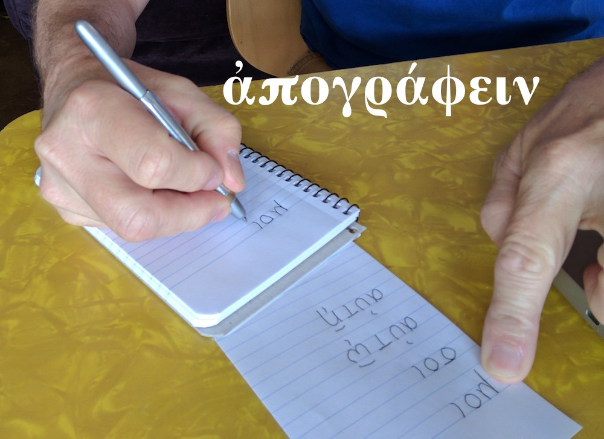
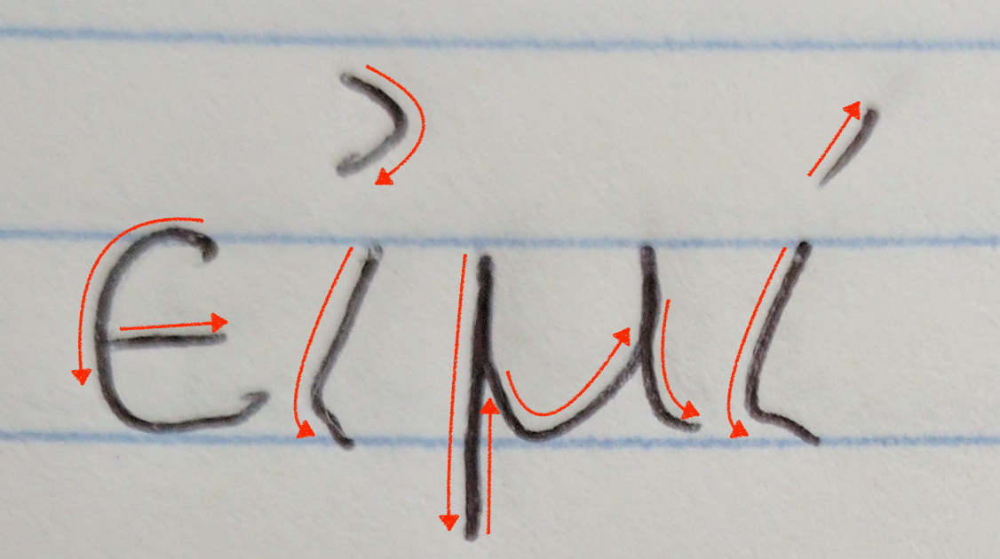
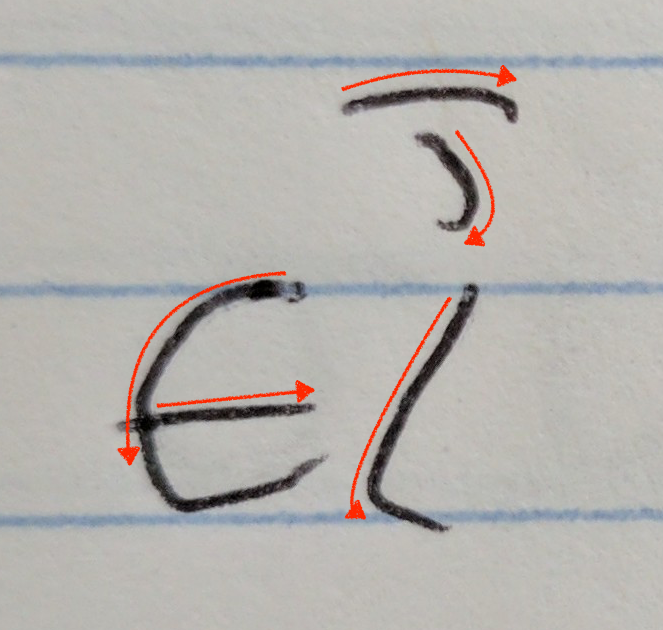
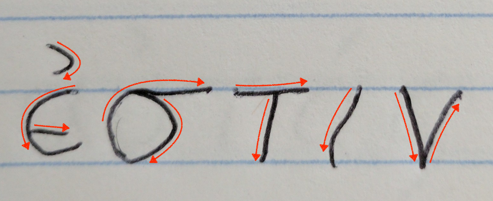
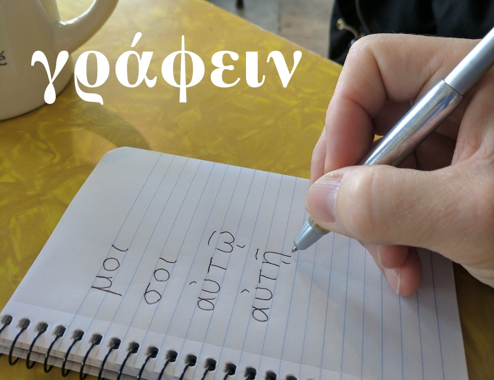

<h1>Student Practice for Lesson Five 
τὸ μελέτημα τοῦ μαθήματος τὸ πέμπτο</h1>

<h3>ἀπογράφε τοὺς λόγους:</h3>

<table>
  <tr>
    <td>
      <ol style="font-size:200%">
        <li>εἰμί </li>
        <li>εἶ </li>
        <li>ἐστιν </li>
      </ol>
    </td>
  </tr>
</table>

<h3>γράφε <em>εἰμί, εἶ,</em> ἤ <em>ἐστιν</em>.</h3>

<ol style="font-size:150%">
  <li>σὺ  μαθητής; 
  ναί.  μαθητής.</li>
  <li>(Μάρθα) 
  Μάρθα  μαθητής; 
  ναί. Μάρθα  μαθητής.</li>
  <li>(Ἰωνάθαν) 
  Ἰωνάθαν  μαθητής; 
  οὔ. Ἰωνάθαν οὒ  μαθητής. Ἰωνάθαν  διδάσκαλος.
  </li>
  <li>(ἐγώ) 
   μαθητής; 
  ναί. σὺ  μαθητής.
  </li>
</ol>
