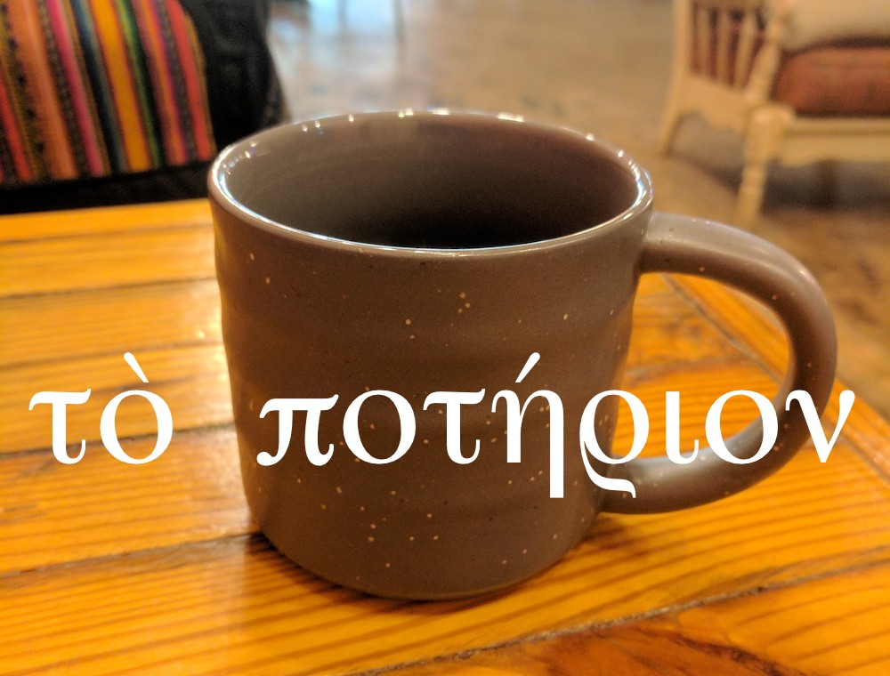

<h1>Student Practice for Lesson Seven 

τὸ μελέτημα τοῦ μαθήματος τὸ ἕβδομον</h1>

<h3>ἔλαβον καὶ ἔδωκεν</h3>

Σοφία ἔδωκεν Χριστοφόρῳ ποτήριον καινόν.

Χριστόφορος ἔλαβον ποτήριον καινὸν ἀπὸ Σοφίας.

<h3>γράφε <em>ναί, οὔ,</em> ἤ τὸ ὄνομα.</h3>

<ol style="font-size:125%">
  <li>τίς ἔδωκεν τὸ ποτήριον; </li>
  <li>τίς ἔλαβον τὸ ποτήριον; </li>
  <li>Σοφία ἔλαβον ποτήριον; </li>
  <li>Χριστόφορος ἔδωκεν ποτήριον Σοφίᾳ; </li>
  <li>τίνι ἔδωκεν Σοφία τὸ ποτήριον; </li>
  <li>ἀπὸ τίνος ἔλαβεν Χριστόφορος τὸ ποτήριον;  
  ἀπὸ </li>
  <li>τί ἔδωκεν Σοφία Χριστοβάλῳ; </li>
</ol>
